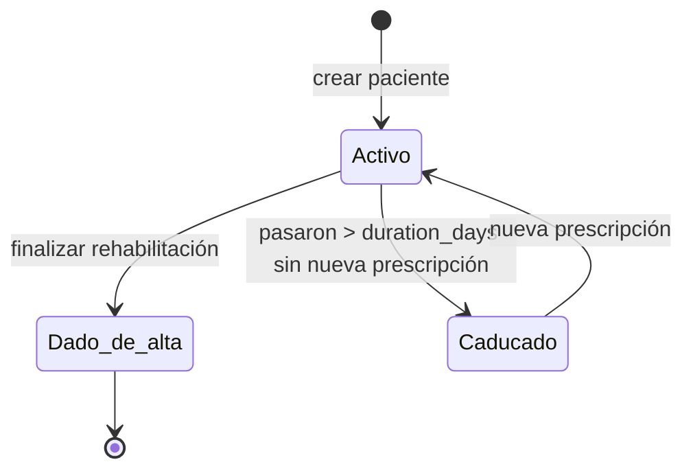

# 09 — Flujos de usuario

## Flujo 1 — Alta de paciente en consulta

```
1. Javi acaba la cura/operación.
2. Javi abre el panel doctor en su portátil/tablet.
3. Click "+ Nuevo paciente".
4. Introduce external_id (ej. "HC-48721" o "P-17").
5. Selecciona patología (flexor / extensor / otros).
6. Click "Crear".
   → Se genera access_token, paciente queda guardado.
7. Pantalla detalle del paciente.
8. Click "Imprimir QR" o muestra el QR en pantalla.
9. Paciente escanea con el móvil → se abre la URL.
10. Paciente: "Compartir" → "Añadir a pantalla de inicio".
11. Javi asigna prescripciones (ejercicio + dosis).
12. Listo. Próxima visita en 2-3 semanas.
```

## Flujo 2 — Sesión del paciente en casa

```
1. Paciente toca el icono Mou en pantalla inicio.
2. Se abre URL → "Sesión 3 de 8".
3. Lista los ejercicios: "Flexión pasiva, 20 reps" + "Extensión activa, 20 reps".
4. Click "Empezar".
5. Pantalla de cámara → permiso → animación de la mano + cámara en vivo.
6. Hace 20 reps. Sistema detecta y cuenta.
7. Pantalla "¡Hecho! 18/20 detectadas" + ángulo medio + máximo.
8. Vuelve a inicio. Próxima sesión en X horas.
9. Datos enviados a BD: 1 fila en `sessions`, 18 filas en `rep_measurements`.
```

## Flujo 3 — Doctor revisa adherencia

```
1. Lunes por la mañana, Javi abre /doctor.
2. Lista de 20 pacientes con barra de adherencia.
3. Tres en rojo (<60%). Click en uno.
4. Detalle: ve que último login fue hace 4 días.
5. Anota en su Excel: "Llamar al paciente 7".
6. Mira gráfico de progresión: muñeca pasa de 30° a 65° en 2 semanas. Buena evolución.
```

## Flujo 4 — Alta clínica

```
1. Paciente vuelve a consulta a las 3 semanas.
2. Javi revisa rango y adherencia con él, en pantalla.
3. Si va bien → click "Finalizar rehabilitación".
4. Confirma.
5. URL del paciente queda invalidada (devuelve "tratamiento finalizado").
6. Datos quedan archivados en BD para análisis posterior.
```

## Flujo 5 — Demo a mutua (post-piloto)

```
1. Reunión con responsable de la mutua.
2. Login en panel doctor.
3. Vista agregada (a construir post-piloto): adherencia media, días de baja estimados con/sin Mou.
4. Drill-down en 2-3 casos: paciente que cumplió → recuperó en X días vs paciente que no cumplió.
5. Cierre comercial: oferta por paciente o licencia mensual.
```

## Estados del paciente



> En Fase 1 podemos no implementar `Caducado` y dejar que la URL siga viva mientras `discharged_at IS NULL`. Documentar como deuda técnica.
